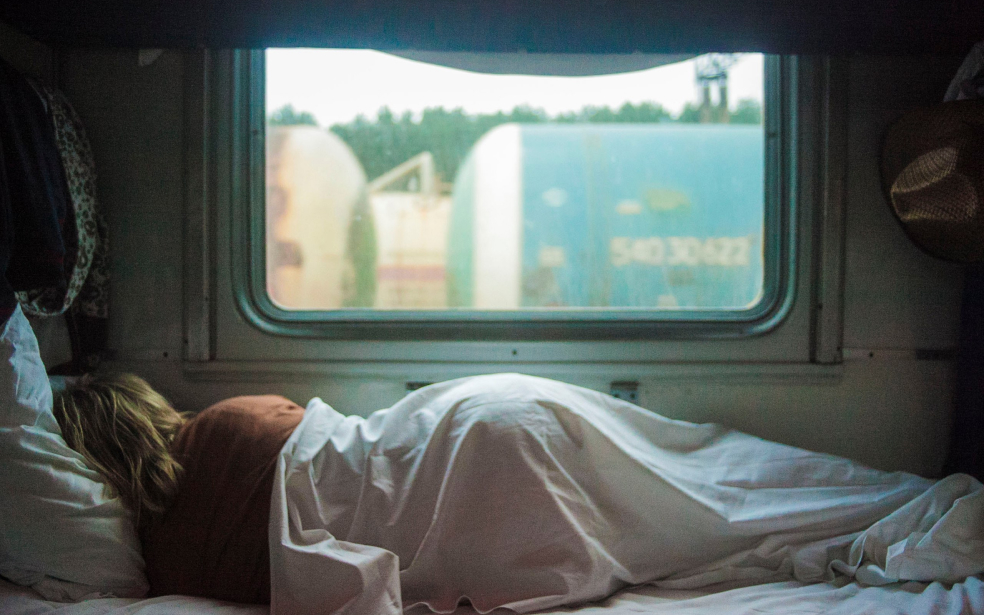

# Проект 3: Путешествие по России

https://loudisence.github.io/russian-travel/.

### Используемые технологии в проекте

*БЭМ - методология web-разработки для структурирования кода и файловой структуре при верстке*

*CSS grid layout*

*flexbox*

*медиазапросы для адаптации сайта под разные девайсы*

